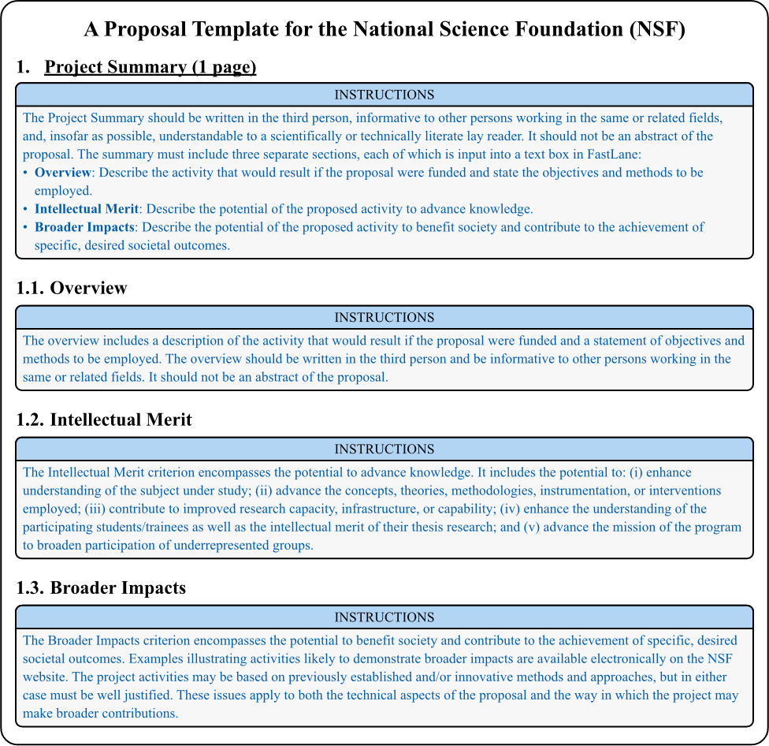

# NSF Proposal Templates
This package contains a series of templates designed to aid in the preparation and submission of proposals to the
National Science Foundation (NSF). A common core template is provided as well as general outlines for a few 
application-specific outlines like the SBIR pitch & technical volume.

## Usage
Simply copy `nsf-proposal.typ` to your project directory and whatever main file you want to use to build your proposal.

## Due Diligence
Headings from provided main files are based on various NSF solicitations and the NSF Proposal & Award Policies &
Procedures Guide (PAPPG). Please ensure that you are using the correct headings for your proposal. There is no guarantee
that every section is present or that the headings are correct. Please submit a pull request if you find any errors or
omissions.

## License
This package is licensed under the MIT License. See the [LICENSE](LICENSE) file for details.

If you use this package for any NSF proposal whose outline is *not* already provided, as a main file, **please** submit
a PR with the same instruction format as the other included examples.